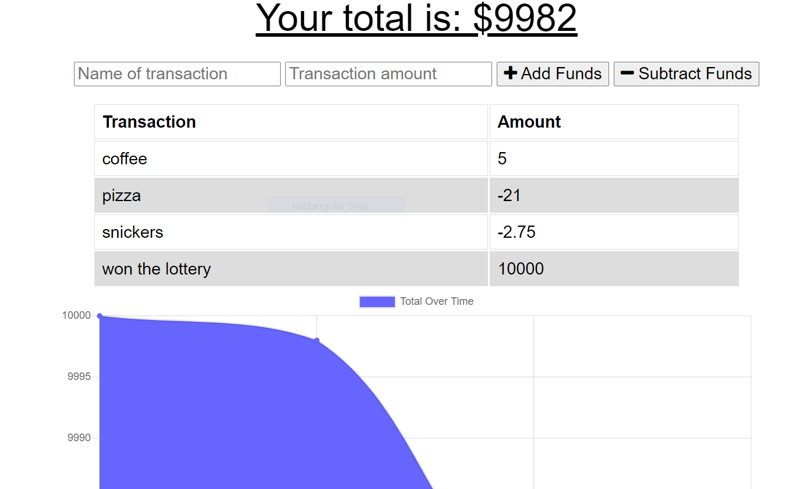

# Online-Offline-Employee-Tracker
This project is designed to keep track of a budget. The user is able to add or subtract funds. The app runs with the server online and offline. When transactions are entered offline, the transactions should populate the app when brought back online.

## Deployment

## Built With
HTML, CSS, JavaScript, Node.js, Express, MongoDB, Mongoose

## Image of Delpoyed Site:
